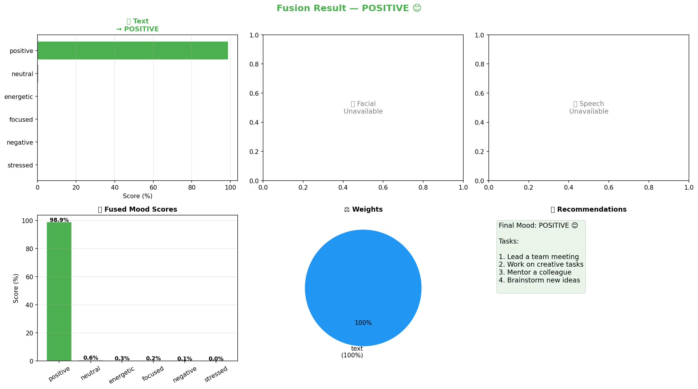

# 🧠 AI-Powered Task Optimizer

> Detects employee emotions from **text**, **facial expressions**, and **voice** using AI, then recommends tasks based on mood — deployed live via ngrok.


---

## 📸 Demo



**Live Demo:** Deployed via ngrok (run `python deploy_ngrok.py` to start)

---

## 🎯 What It Does

The system analyzes an employee's emotional state using 3 AI models simultaneously:

| Modality | Model | What it detects |
|---|---|---|
| 📝 Text | DistilBERT (fine-tuned) | Emotion from written text |
| 📸 Facial | DeepFace (pretrained) | Emotion from webcam photo |
| 🎙️ Speech | wav2vec2 (pretrained) | Emotion from voice recording |

All 3 results are fused using weighted late fusion (Text 40% + Facial 35% + Speech 25%) to produce a final mood and task recommendations.

### 6 Mood Categories

| Mood | Emoji | Recommended Tasks |
|---|---|---|
| Positive | 😊 | Lead meetings, creative work, mentoring |
| Negative | 😔 | Short break, admin tasks, review docs |
| Neutral | 😐 | Routine tasks, emails, meetings |
| Energetic | ⚡ | Challenging problems, new projects |
| Stressed | 😰 | Break, breathing exercises, low-priority |
| Focused | 🎯 | Documentation, code review, research |

---

## 🏗️ Architecture

```
ai_task_optimizer/
├── src/
│   ├── config.py                 ← shared config (paths, labels, weights)
│   ├── module1_text_emotion.py   ← train DistilBERT on GoEmotions
│   ├── module2_facial_emotion.py ← DeepFace emotion detection
│   ├── module3_speech_emotion.py ← wav2vec2 speech emotion
│   ├── module4_fusion.py         ← weighted late fusion of all 3
│   ├── module5_api.py            ← FastAPI REST backend
│   └── module6_frontend.py       ← React dashboard generator
├── data/
│   ├── employees.csv             ← employee profiles
│   ├── processed/                ← train/val/test splits
│   ├── facial/webcam_captures/   ← saved webcam photos
│   └── speech/recordings/        ← saved mic recordings
├── models/
│   ├── text_emotion/best_model/  ← fine-tuned DistilBERT
│   ├── facial_emotion/           ← DeepFace config
│   ├── speech_emotion/           ← wav2vec2 config
│   └── fusion/                   ← fusion config + ngrok URL
├── logs/                         ← mood history, training logs
├── outputs/                      ← generated dashboard.html
├── eda/charts/                   ← saved visualizations
├── deploy_ngrok.py               ← one-command public deployment
└── requirements.txt
```

---

## ⚙️ Setup

### Prerequisites
- Python 3.11+
- NVIDIA GPU recommended (GTX 1650 or better)
- Webcam + Microphone
- [ffmpeg](https://ffmpeg.org/download.html) added to PATH
- [ngrok account](https://ngrok.com) (free)

### 1. Clone the repo
```bash
git clone https://github.com/YOUR_USERNAME/ai-task-optimizer.git
cd ai-task-optimizer
```

### 2. Create virtual environment
```bash
python -m venv venv

# Windows
venv\Scripts\activate

# Mac/Linux
source venv/bin/activate
```

### 3. Install dependencies
```bash
pip install -r requirements.txt
pip install accelerate nest_asyncio pyngrok
```

### 4. Install PyTorch with CUDA (GPU users)
```bash
# CUDA 12.1
pip install torch==2.2.2 torchaudio==2.2.2 --index-url https://download.pytorch.org/whl/cu121

# CPU only
pip install torch==2.2.2 torchaudio==2.2.2
```

---

## 🚀 Running the Project

### Step 1 — Train the Text Model (one time only, ~30 min on GPU)
```bash
python src/module1_text_emotion.py
```
Downloads GoEmotions dataset and fine-tunes DistilBERT. Saves to `models/text_emotion/best_model/`.

### Step 2 — Test Facial Emotion
```bash
# Webcam (press SPACE to capture)
python src/module2_facial_emotion.py

# Or use an existing image
python src/module2_facial_emotion.py --image path/to/photo.jpg
```

### Step 3 — Test Speech Emotion
```bash
# Record from mic (5 seconds)
python src/module3_speech_emotion.py

# Or use existing audio
python src/module3_speech_emotion.py --audio path/to/audio.wav
```

### Step 4 — Test Fusion
```bash
python src/module4_fusion.py --emp_id EMP001
```

### Step 5 — Deploy Publicly (API + Dashboard + ngrok)
```bash
python deploy_ngrok.py
```

Add your ngrok token to `deploy_ngrok.py` first:
```python
NGROK_TOKEN = 'your_token_here'
```

Get your token at [dashboard.ngrok.com](https://dashboard.ngrok.com).

Your app goes live at a public URL like:
```
https://xxxx-xxxx-xxxx.ngrok-free.app
```

---

## 🌐 API Endpoints

| Method | Endpoint | Description |
|---|---|---|
| GET | `/` | Dashboard (HTML) |
| GET | `/health` | API health check |
| GET | `/employees` | List all employees |
| POST | `/employees` | Add new employee |
| DELETE | `/employees/{id}` | Delete employee |
| POST | `/analyze` | Full fusion (text + image + audio) |
| POST | `/analyze/text` | Text only |
| POST | `/analyze/facial` | Image only |
| POST | `/analyze/speech` | Audio only |
| GET | `/mood-history` | Mood session log |
| GET | `/mood-history/summary` | Mood distribution stats |
| GET | `/alerts` | HR burnout alerts |
| GET | `/docs` | Swagger UI |

---

## 📊 Model Performance

**Text Model (DistilBERT on GoEmotions):**

| Mood | Precision | Recall | F1 |
|---|---|---|---|
| Positive | 0.784 | 0.841 | 0.812 |
| Negative | 0.674 | 0.620 | 0.646 |
| Neutral | 0.642 | 0.675 | 0.658 |
| Energetic | 0.566 | 0.443 | 0.497 |
| Stressed | 0.656 | 0.629 | 0.642 |
| Focused | 0.491 | 0.378 | 0.427 |
| **Overall** | **0.684** | **0.690** | **0.685** |

Trained on GTX 1650 (4GB VRAM) with fp16 mixed precision.

---

## 🖥️ Dashboard Features

- **Overview** — mood stats, top mood, HR alert count, API health
- **Analyze Mood** — text input + live webcam + microphone recording
- **Employees** — add/delete employee profiles
- **Mood History** — all past sessions filterable by employee
- **HR Alerts** — burnout risk detection with severity levels

---

## 🔧 Configuration

Edit `src/config.py` to change:
- `TRAIN_BATCH` — batch size for training (use 8 for 4GB VRAM)
- `BASE_WEIGHTS` — fusion weights (text/facial/speech)
- `BURNOUT_THRESHOLD` — consecutive stress sessions before alert
- `API_PORT` — default 8000

---

## 📦 Tech Stack

| Component | Technology |
|---|---|
| Text Emotion | DistilBERT (Hugging Face Transformers) |
| Facial Emotion | DeepFace + TensorFlow |
| Speech Emotion | wav2vec2 (Hugging Face) |
| Backend API | FastAPI + Uvicorn |
| Frontend | React 18 (CDN, no build tools) |
| Deployment | ngrok |
| Data | GoEmotions (Google, 54K samples) |

---

## 👤 Author

Built as part of a student ML project using the GitHub Student Developer Pack.

---

## 📄 License

MIT License — feel free to use, modify, and distribute.
